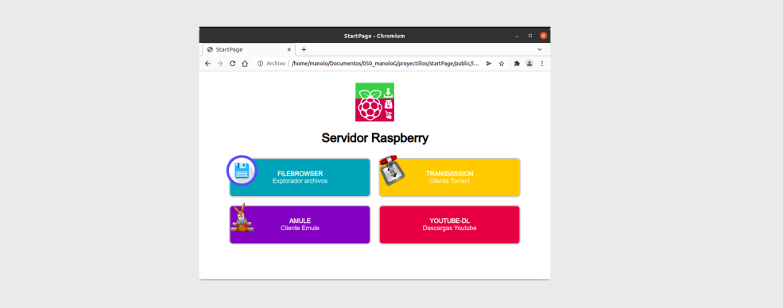

# Start page for raspberry Pi

Cuando instalamos varios servicios en nuestra raspberry, con sus interface web corriendo por varios puertos, tengo la costumbre de ponerle una pagina de inicio para que se sirva de indice para llamar la resto de los servicios de los distintos puertos.



Este sencillo interface web que nos cargar una lista de servicios que se encuentran en un array en el fichero code.js. Si necesitamos añadir o eliminar algún servido, se modifica los datos

```

  const elements = [
      {
          name: "FILEBROWSER",
          description: "Explorador archivos",
          url: "http://192.168.1.222:8088/",
          color: "#17a2b8",
          logo: "https://avatars.githubusercontent.com/u/35781395?s=280&v=4"
      },
      .....

```

Para ponerlo en funcionamiento, clonamos el repositorio, modificamos los servicio y direcciones y lo correremos la aplicación dentro de un docker de nginx conectado al puerto 80.

Y con esto ya lo tenemos disponible, llamando a la ip de la raspberry con el navegador  http://192.168.1.222


    docker run -d --name=nginx_index --restart unless-stopped -v ./public:/usr/share/nginx/html:ro -p 80:80 nginx:alpine


si lo queremos correr con docker-compose

    index:
      image: nginx:alpine
      restart: always
      container_name: nginx_index
      ports:
        - 80:80
      volumes:
        - ./index/public:/usr/share/nginx/html:ro
